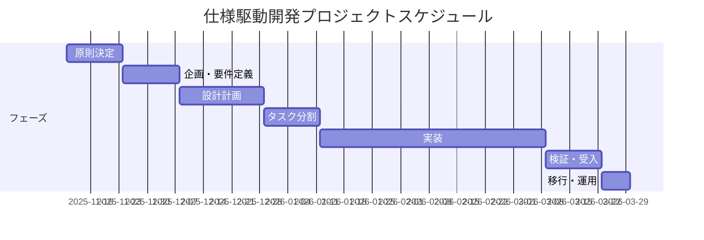

# タスク分割工程

このファイルは、仕様駆動開発の**タスク分割工程**で作成されるタスク分割書です。

## タスク分割の原則

仕様駆動開発のタスク分割工程では、「1タスク＝30分レビューで終わる」程度の粒度を推奨します。

## マイルストーン

### マイルストーン1: 原則決定工程完了（2週間後）

- [ ] プロジェクト憲章（[01-principle-definition.md](./01-principle-definition.md)）の策定
- [ ] ステークホルダーとの合意形成
- [ ] 基本原則の明確化

### マイルストーン2: 企画・要件定義工程完了（4週間後）

- [ ] 機能要件の詳細化
- [ ] 非機能要件の明確化
- [ ] 未決定事項の整理
- [ ] 顧客との合意形成

### マイルストーン3: 設計計画工程完了（7週間後）

- [ ] 技術スタックの選定（AIを活用した複数案の比較）
- [ ] データベース設計
- [ ] API設計
- [ ] UI/UX設計
- [ ] セキュリティ設計
- [ ] レビュー会の実施

### マイルストーン4: タスク分割工程完了（9週間後）

- [ ] 各機能のタスク分解（30分レビュー可能な粒度）
- [ ] 依存関係の整理
- [ ] 優先度の設定
- [ ] 進捗管理ツールへの反映

### マイルストーン5: 実装工程完了（17週間後）

- [ ] 顧客情報管理機能の実装
- [ ] 営業活動履歴機能の実装
- [ ] レポート機能の実装
- [ ] 権限管理機能の実装
- [ ] コードレビューの実施（AI生成コードも必ず人間がレビュー）

### マイルストーン6: 検証・受入工程完了（19週間後）

- [ ] 統合テストの実施
- [ ] 仕様差分レポートの作成
- [ ] 顧客との受入テスト
- [ ] 変更履歴の説明

### マイルストーン7: 移行・運用工程完了（20週間後）

- [ ] 本番環境への移行
- [ ] 運用マニュアルの作成
- [ ] 運用開始
- [ ] フィードバック収集の仕組み構築

## タスク分解の例

### 機能1: 顧客情報の管理

#### タスク1.1: データベーススキーマの設計（30分レビュー）

- **依存**: 設計計画工程の完了
- **優先度**: 高
- **見積もり**: 2時間

#### タスク1.2: 顧客情報登録APIの実装（30分レビュー）

- **依存**: タスク1.1の完了
- **優先度**: 高
- **見積もり**: 4時間

#### タスク1.3: 顧客情報一覧表示APIの実装（30分レビュー）

- **依存**: タスク1.1の完了
- **優先度**: 高
- **見積もり**: 3時間

#### タスク1.4: 顧客情報検索機能の実装（30分レビュー）

- **依存**: タスク1.3の完了
- **優先度**: 中
- **見積もり**: 4時間

### 機能2: 営業活動履歴の記録

#### タスク2.1: 営業活動履歴データベーススキーマの設計（30分レビュー）

- **依存**: 設計計画工程の完了
- **優先度**: 高
- **見積もり**: 2時間

#### タスク2.2: 訪問記録登録APIの実装（30分レビュー）

- **依存**: タスク2.1の完了
- **優先度**: 高
- **見積もり**: 3時間

## 依存関係の整理

## 進捗管理

仕様駆動開発では、日本式の進捗報告会に流用できるよう、バーンダウンチャートやガントチャートを出力します。

---

**注意**: このタスク分割書は、仕様駆動開発の「7つの工程」のうち、**タスク分割工程**の成果物です。次の工程（実装工程）では、このタスクを基に実装を進めます。

